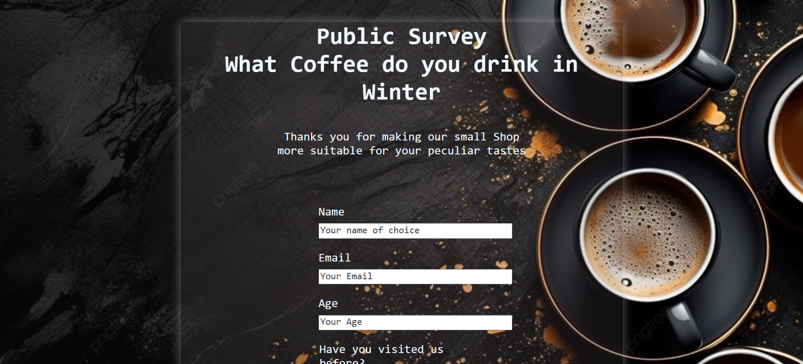

An old project build back in 2024 as the start of my journey and posted here to preserve my path.

The project only consists of **HTML** + **CSS** and was made as a part of FreeCodeCamp's Responsive Web Design course.

>[My official FCC's Certificate](https://www.freecodecamp.org/certification/fcc058fd235-9bca-44b6-b085-10ee4a9bdda6/responsive-web-design)

---

## 📋 Project Requirements

This project was built to fulfill the following **15 user stories** from FreeCodeCamp's "Build a Survey Form" challenge:

<b>Click to expand the full requirements</b>

 

**User Stories:**
- [x] Page title in `h1` element with `id="title"`
- [x] Description in `p` element with `id="description"` 
- [x] Form element with `id="survey-form"`
- [x] Name input field (`id="name"`, `type="text"`)
- [x] Email input field (`id="email"`) with HTML5 validation
- [x] Number input field (`id="number"`) with min/max attributes
- [x] Label elements for name, email, and number (`id="name-label"`, `id="email-label"`, `id="number-label"`)
- [x] Placeholder text for name, email, and number inputs
- [x] Select dropdown (`id="dropdown"`) with at least 2 options
- [x] Radio button group (at least 2 options)
- [x] Checkbox group (multiple selections with `value` attributes)
- [x] `textarea` for additional comments
- [x] Submit button (`id="submit"`)
- [x] HTML5 validation errors for invalid email and out-of-range numbers
- [x] Custom personal styling

**All tests passed** ✅

---

## 🎨 About the Project

Unfortunately, the original background image used in the work went down (it was hosted via URL back in 2024) and the project doesn't look as it used to. I replaced it with a similar dark textured background so the text remains visible.

But luckily I still have a screenshot of the original version, so it can still be preserved in some way:

| Original (2024) | Current |
|-----------------|---------|
|  |  |

<i>submitted to FreeCodeCamp on Oct 6, 2024</i>

---

## 🔗 Live Demo

---

*Part of my [FreeCodeCamp journey](https://www.freecodecamp.org/certification/fcc058fd235-9bca-44b6-b085-10ee4a9bdda6/responsive-web-design)*